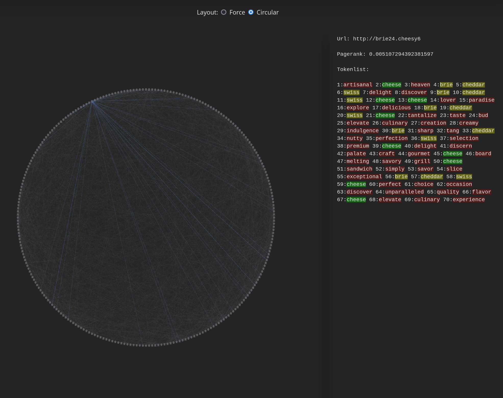
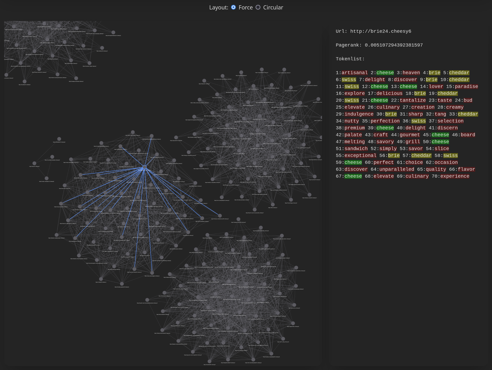

This project consists of two main components:

1. **[Frontend](https://github.com/Sim-sat/searchFrontEnd)**: A React application that provides an interface for searching and visualizing data from an intranet.
2. **[Backend](https://github.com/Sim-sat/searchBackEnd.git)**: A Quarkus-based application running on an Azure Virtual Machine (VM) that powers the API and handles data processing. The webserver runs in a nginx docker.

---


### Features
- **Intranet Search**: Search across 260 intranet pages
- **Search Modes**:
  - tdidf score
  - cosine similarity
  - cosine similarity + pagerank
 
- **Graph Visualization**: Display relationships between intranet pages in an interactive graph.
    - hover node to highlight all links
    - click node to see tokens with tf-score
    - circular mode
    
    - force mode
    

- **PageRank and TF Score Visualization**: Visualize page ranking and term frequency scores.

The content of the sites is very basic and the site has no real use. The sites contain a lot of content about cheeses so use corresponding queries. 

### [Live Preview](https://searchenginecheese.netlify.app/ "Live Preview")


### Prerequisites
- Node.js (v16 or later)
- npm

### Setup
1. Start backend
2. Clone the repository:
   ```bash
   git clone (https://github.com/Sim-sat/searchFrontEnd.git)
   cd searchFrontEnd
   ```
3. Install dependencies:
   ```bash
   npm install
   ```
4. Start the development server:
   ```bash
   npm start
   ```
5. Access the application at `http://localhost:5173`.

### Build
To create a production build:
```bash
npm run build
```

